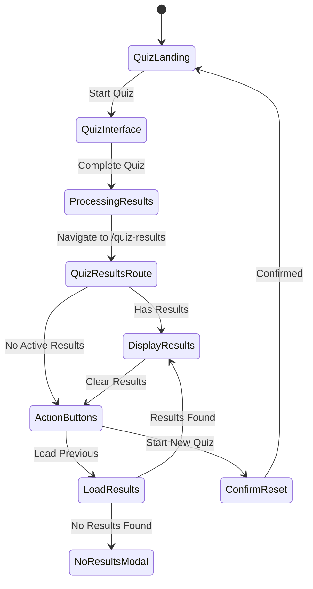

# Quiz Results Routing and Persistence Design

## Overview

This design implements a dedicated quiz results route with localStorage persistence, enabling users to access their quiz results via direct navigation while maintaining data across browser sessions. The system provides a clean separation between quiz flow and results viewing, with robust state management and user experience considerations.

## Architecture

### Route Structure
```
/ (homepage)
├── QuizLanding (currentQuestionIndex: -1)
├── QuizInterface (currentQuestionIndex: 0-N)
└── /quiz-results (dedicated results route)
    ├── QuizResultsPage (new page component)
    ├── QuizResults (existing component, refactored)
    └── ResultsActionButtons (new component)
```

### State Management Flow


## Components and Interfaces

### 1. QuizResultsPage Component (New)
**Location:** `src/pages/QuizResultsPage.tsx`

**Purpose:** Main page component for the /quiz-results route

**Props:** None (uses context and localStorage)

**State:**
- `showActionButtons: boolean` - Whether to show action buttons or results
- `showNoResultsModal: boolean` - Modal for no previous results
- `showResetModal: boolean` - Confirmation modal for starting new quiz

**Key Methods:**
- `loadPreviousResults()` - Load results from localStorage
- `handleStartNewQuiz()` - Show reset confirmation
- `handleLoadPrevious()` - Attempt to load previous results
- `clearCurrentResults()` - Clear active results and show action buttons

### 2. ResultsActionButtons Component (New)
**Location:** `src/components/quiz/ResultsActionButtons.tsx`

**Purpose:** Action buttons for when no active results exist

**Props:**
```typescript
interface ResultsActionButtonsProps {
  onStartNewQuiz: () => void;
  onLoadPrevious: () => void;
}
```

**Layout:**
- Left button: "Start New Quiz" (primary styling)
- Right button: "Load Previous Results" (secondary styling)
- Centered container with responsive design

### 3. Enhanced QuizContext
**Updates to:** `src/contexts/QuizContext.tsx`

**New State Properties:**
```typescript
interface QuizState {
  // ... existing properties
  savedResults: QuizResults | null;
  isResultsRoute: boolean;
}
```

**New Actions:**
```typescript
type QuizAction =
  // ... existing actions
  | { type: 'SAVE_RESULTS_TO_STORAGE'; payload: QuizResults }
  | { type: 'LOAD_RESULTS_FROM_STORAGE'; payload: QuizResults | null }
  | { type: 'CLEAR_ACTIVE_RESULTS' }
  | { type: 'SET_RESULTS_ROUTE'; payload: boolean }
```

**New Methods:**
- `saveResultsToStorage(results: QuizResults)` - Save to localStorage
- `loadResultsFromStorage()` - Load from localStorage with validation
- `clearActiveResults()` - Clear current results display
- `hasStoredResults()` - Check if valid results exist in storage

### 4. Enhanced QuizResults Component
**Updates to:** `src/components/quiz/QuizResults.tsx`

**New Props:**
```typescript
interface QuizResultsProps {
  showClearButton?: boolean; // Show button to clear results and return to actions
  onClearResults?: () => void; // Callback when results are cleared
}
```

**Changes:**
- Add optional clear results button
- Remove navigation logic (handled by page component)
- Focus purely on results display

## Data Models

### LocalStorage Schema
**Key:** `career-quiz-results`

**Structure:**
```typescript
interface StoredQuizResults {
  results: QuizResults;
  timestamp: string;
  version: string;
  quizVersion: string; // For future compatibility
}
```

**Validation Rules:**
- Must have valid `results` object with required properties
- Timestamp must be valid ISO string
- Version must match current application version
- Results must include both basic and AI analysis data

### Navigation State
```typescript
interface NavigationState {
  fromQuizCompletion: boolean; // True if navigated from quiz completion
  hasActiveResults: boolean;   // True if results are currently loaded
  canLoadPrevious: boolean;    // True if localStorage has valid results
}
```

## Error Handling

### LocalStorage Errors
1. **Storage Unavailable:** Gracefully degrade to session-only results
2. **Quota Exceeded:** Clear old data and retry save
3. **Corrupted Data:** Treat as no results available
4. **Parse Errors:** Log error and treat as no results available

### Navigation Errors
1. **Invalid Route Access:** Redirect to homepage with message
2. **Missing Context:** Initialize with empty state
3. **Component Mount Errors:** Show error boundary with recovery options

### Data Validation Errors
1. **Incomplete Results:** Show partial results with warning
2. **Version Mismatch:** Attempt migration or treat as invalid
3. **Missing AI Analysis:** Show basic results only

## Testing Strategy

### Unit Tests
- LocalStorage operations (save, load, validate)
- Component state management
- Navigation logic
- Error handling scenarios

### Integration Tests
- Complete quiz flow to results page
- Browser navigation (back/forward)
- LocalStorage persistence across sessions
- Modal interactions and confirmations

### User Experience Tests
- Direct navigation to /quiz-results
- Bookmark and refresh behavior
- Mobile responsive design
- Accessibility compliance

## Implementation Phases

### Phase 1: Core Infrastructure
1. Create QuizResultsPage component
2. Add /quiz-results route to App.tsx
3. Implement localStorage utilities
4. Update QuizContext with new state/actions

### Phase 2: User Interface
1. Create ResultsActionButtons component
2. Add modals for no results and reset confirmation
3. Update QuizResults component with clear functionality
4. Implement scroll-to-top integration

### Phase 3: Navigation Integration
1. Update quiz completion flow to navigate to /quiz-results
2. Implement browser navigation handling
3. Add route guards and error boundaries
4. Test cross-browser compatibility

### Phase 4: Polish and Testing
1. Add loading states and transitions
2. Implement comprehensive error handling
3. Add accessibility features
4. Performance optimization and testing

## Security Considerations

### Data Privacy
- Results stored only in user's browser localStorage
- No sensitive data transmitted to external services
- Clear data removal on user request

### Data Integrity
- Validate all localStorage data before use
- Implement version checking for compatibility
- Sanitize any user-generated content in results

### Error Information
- Avoid exposing internal system details in error messages
- Log errors for debugging without user data
- Provide helpful user-facing error messages

## Performance Considerations

### LocalStorage Optimization
- Compress results data before storage
- Implement cleanup of old/invalid data
- Monitor storage usage and implement limits

### Component Performance
- Lazy load results components when needed
- Memoize expensive calculations
- Optimize re-renders with proper dependency arrays

### Navigation Performance
- Preload critical route components
- Implement proper loading states
- Optimize bundle splitting for routes
